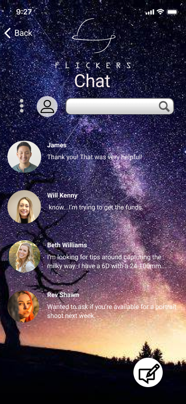
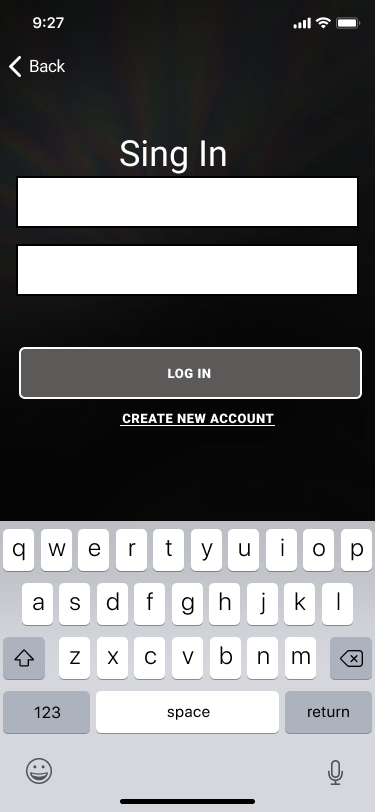
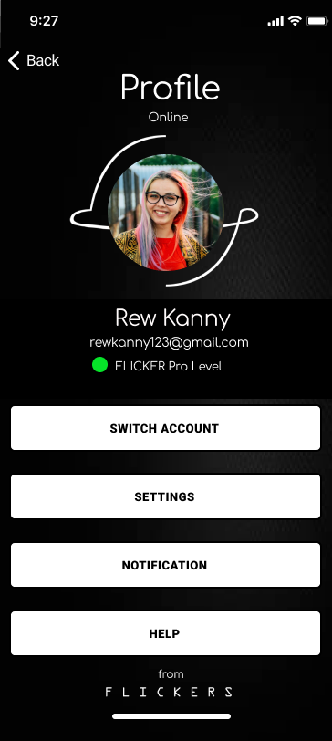
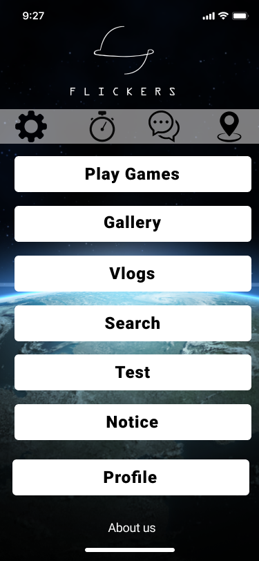
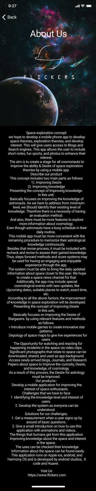
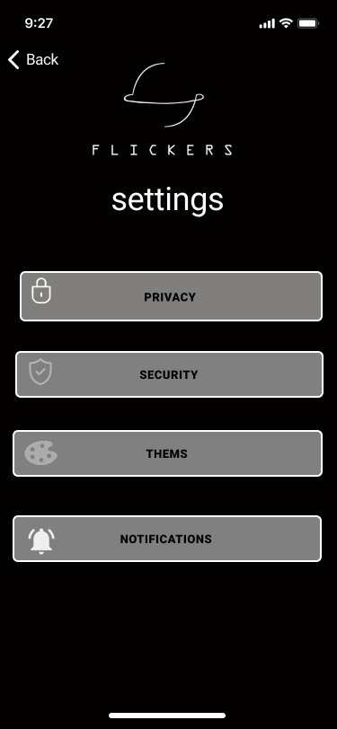
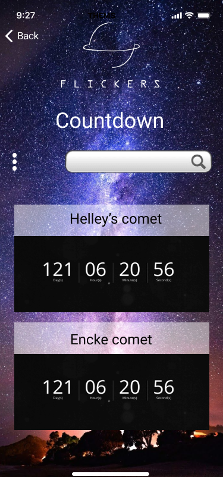

# Flicker Mobile App Prototype
Flickers - Astronomy Knowledge App
Description:
Flickers is a mobile application designed to help astronauts and space enthusiasts expand their knowledge about astronomy. The app offers a variety of features such as games, galleries, vlogs, and more, all centered around astronomical events, celestial bodies, and space missions. The app also includes tools to track comet locations, meteor showers, and other significant celestial events.

The Figma prototype and wireframe for the app can be found here.
- Link: https://www.figma.com/proto/E5RFPgCGKPmC4ej1zpo3I5/filcker-app-prototype?node-id=110-1441&starting-point-node-id=182%3A632&t=FlujZHkT8QWbjllJ-1
- Link (wireframe): https://www.figma.com/proto/2cOiHfQnZqU8jLvpaReNYK/Wireframing-in-Figma?node-id=112-519&node-type=canvas&t=3XeOdm5eanU0TGML-1&scaling=scale-down&content-scaling=fixed&page-id=0%3A1&starting-point-node-id=112%3A498

# Features
- User Authentication: Allows users to create and manage their profiles with strong privacy settings.
- Comet Countdown: Tracks upcoming comets and meteor showers, allowing users to set reminders for these events.
- Gallery: Contains photos and videos of stars, galaxies, planets, and pulsars, with daily updates.
- Games: A collection of space-related games to improve knowledge and enjoy while learning.
- Vlogs: Offers links to external resources such as NASA, Canadian Space Agency, and more for additional information.
- Search: Users can explore various astronomical topics like the Moon, Earth, and the International Space Station.
- Noticeboard: Users can compose and view astronomy-related notices.

## App Navigation

- Home Screen: Access various sections like settings, chat, comet locations, and the countdown timer.
- Profile Section: View and edit profile details, change security settings, and manage notifications.
- Chat: Connect with other users, search contacts, and compose messages.
- Settings: Modify app themes (light/dark mode), security options, and notification preferences.

## Screenshots

.png)

